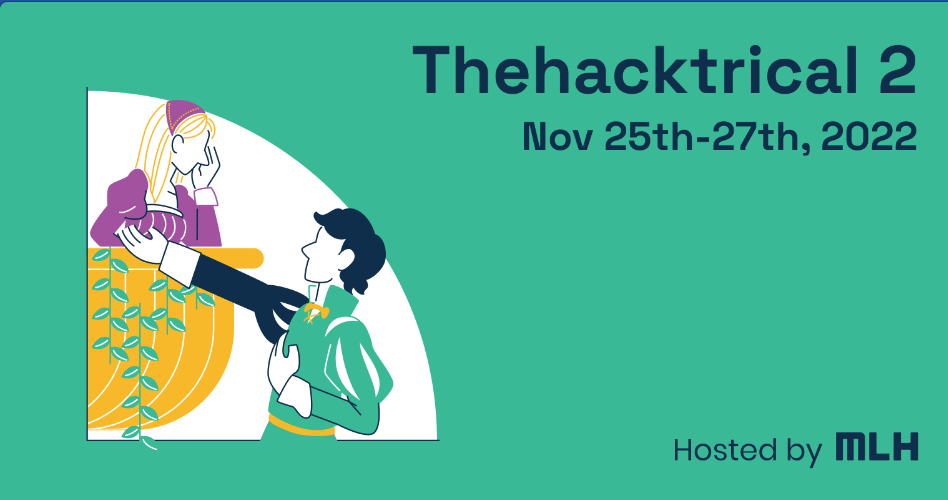
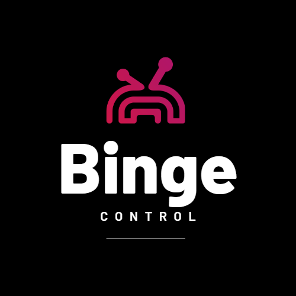
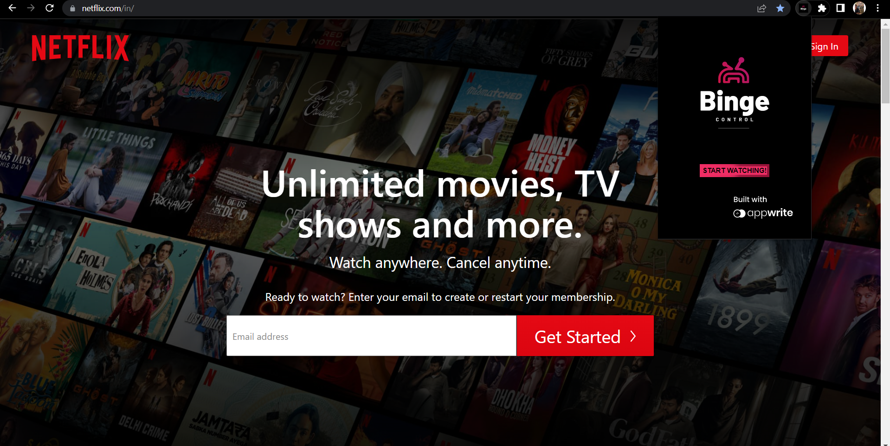

  

  

 

<b>Presenting BingeControl
 
Stay sharp before you Binge</b>

<blockquote align="center"> 
  built on ☕ at Thehacktrical 2</a>.

</blockquote>

# 💡 Problem Statement

According to recent data from top streaming service <i> <b> Netflix </b> </i>; 70% of the users on the platform binge watch shows. A large chunk of the viewership comes from the youth age groups in between 15-27 years. We incorporated a chrome extension to help you control your binge habits with the help of a reward system. Based on points gained from tasks that simulate physical / mental activity, you can earn watch time which can be used to keep you accountable for the watch time. 

# 🧠 Knowledge Primer

- Binge watch refers to watching multiple episodes of a TV show or movie in rapid succession. With the intriguing plot lines, users are more inclined than before to binge watch shows at a faster pace than before. 
- A vast majority of these users look for solutions that would allow for them to control the habit of binge watching so that they can control cummilative habits such as procrastination. 

# 📺 Preview

  

# 💻 Tech Stack

- Appwrite
- ExpressJS
- ReactJS
- NodeJS
- HTML
- CSS 

# 🔧 Utilisation

1. Go to **[`chrome://extensions`](chrome://extensions)** enable developer mode, with developer mode enabled; choose `load unpacked` and navigate to the `chrome extension` folder. 
2. After the extension is added, click on start watching on start recording the time when you're on [`Netflix.com`](https://netflix.com/in/) 

# ⏭️ What's next

- Add more websites to track, with more customizing options
- Setup lap-timers to interrupt binge watches at a specific time rate
- Connection to social accounts to showcase your control over binging!

# 📜 License

`BingeControl` is available for opensource use. 

# 🤝 Contributing

- Fork the repo
- You can add in your changes and create a PR which will be reviewed at the earliest!

# 💥 Contributors

                                                                                  
# 🚨 Forking this repo

Many people have contacted us asking if they can use this code for their own websites. The answer to that question is usually "yes", with attribution. There are some cases, such as using this code for a business or something that is greater than a personal project, that we may be less comfortable saying yes to. If in doubt, please don't hesitate to ask us.

We value keeping this site open source, but as you all know, _**plagiarism is bad**_. We spent a non-negligible amount of effort developing, designing, and trying to perfect this iteration of our website, and we are proud of it! All we ask is to not claim this effort as your own.

Refer to this handy [quora post](https://www.quora.com/Is-it-bad-to-copy-other-peoples-code) if you're not sure what to do. Thanks!
